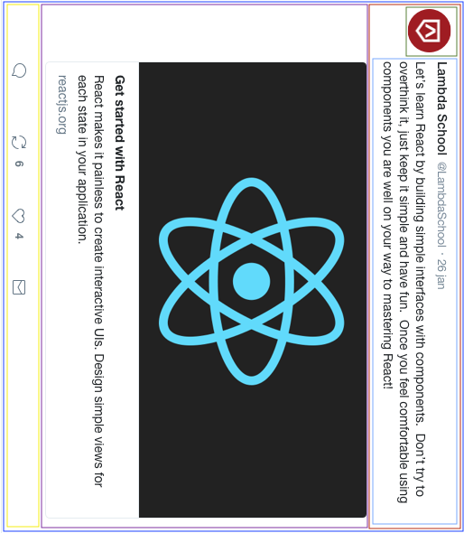

# React-UI-Components

- This repository is designed to be your first exposure into the world of ReactJS. You will be given 2 days to complete the 2 assignments in this repository. Day 1 is all about implementing a Social Card in ReactJS. On Day 2 you'll be implementing a Calculator. We've given you the file structure and have gone ahead and added all the files you'll need to be set up for success for each project.

## Initializing the application.

- This project was bootstrapped using `create-react-app` (CRA). **You will not need to install CRA in order to make this project work**
- Each project has it's own `package.json` file in it, we'll chat more about this later. So it's already set up for you to install some dependencies that are needed for you to be able to work within the React Ecosystem.
- To start the `Social Card` project, you'll need to cd into `Day-1-Social-Card` and then into `social-card` and run `yarn install` to retrieve all the dependencies.
- Inside of `../../social-card` you'll then need to run `yarn start` to open up a React Development Server that can take your `.js` files as components and bundle them up to work in your new environment.
- **You'll repeat this last two steps for the calculator project, but you'll need to make sure that you're inside of `../../calculator` directory to make this work.**

## Instructions

- Over the next two days you'll be working on two different projects in this repo.
  - The first day you'll work on the project found in `Day-I-Social-Card`.
  - The second day you'll work on the project found in `Day-II-Calculator`.
- Use the design files to build out your User Interfaces.
- All components can be built out using the provided html files found in their respective directories.
- Each file has been set up to work within a `react.js` environment. Pay attention to the notes found within each project.
- All styles can be written inside of
- Feel free to include a `cdn` for bootstrap v.4 if you'd like in your `index.html`.
  - This should include bootstraps style sheet globally for all of your components.
  - Don't forget about `className` vs `class` on your `JSX elements`!!

## _Day I - Social Card_

- We're going to break down this assignment in terms of how you should be starting to think in react. Remember that everything is a component.
- We have drawn boxes around possible areas that could be components.
  - The outer box will represent the `App.js` file.
  - The red box around the header could represent the `header` directory with a few nested components inside, the thumbnail image and the header content.
  - You could go so far as to break down the header content into a header and body component.
  - The next box around the social card represents the React Banner image and some copy found underneath.
  - And then of course the footer (**Stretch Problem 1**) which contains your icons, could be a container for all of your icon components.

#### Day 1 MVP requirements

#### Day 1 Stretch Problems

## _Day II - React Calculator_

-
